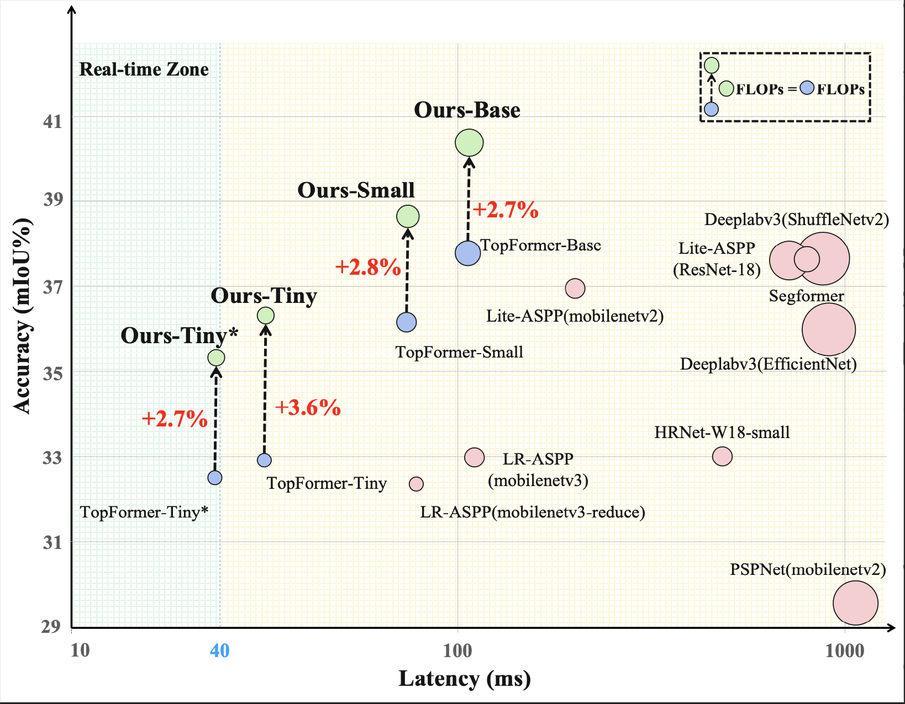
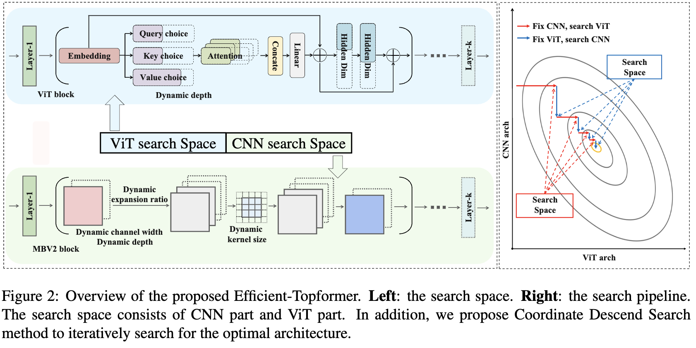
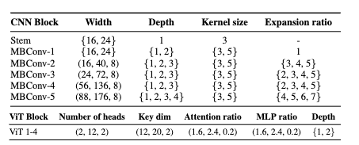
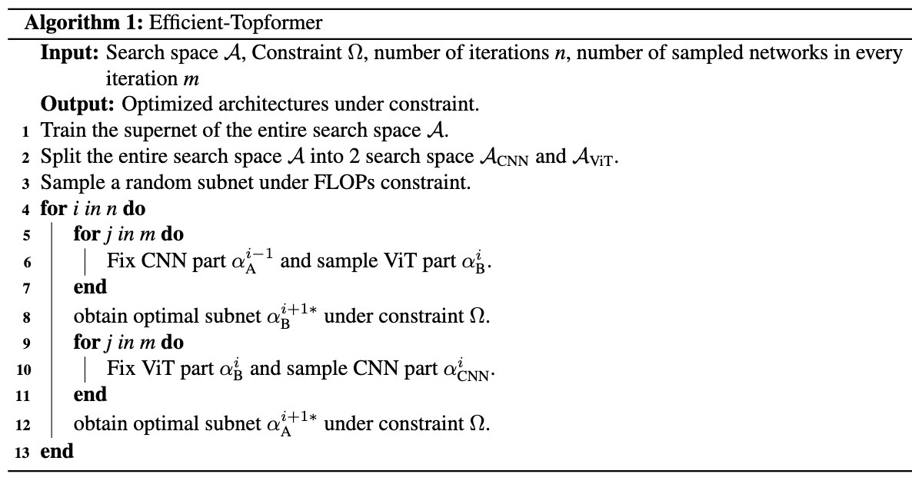
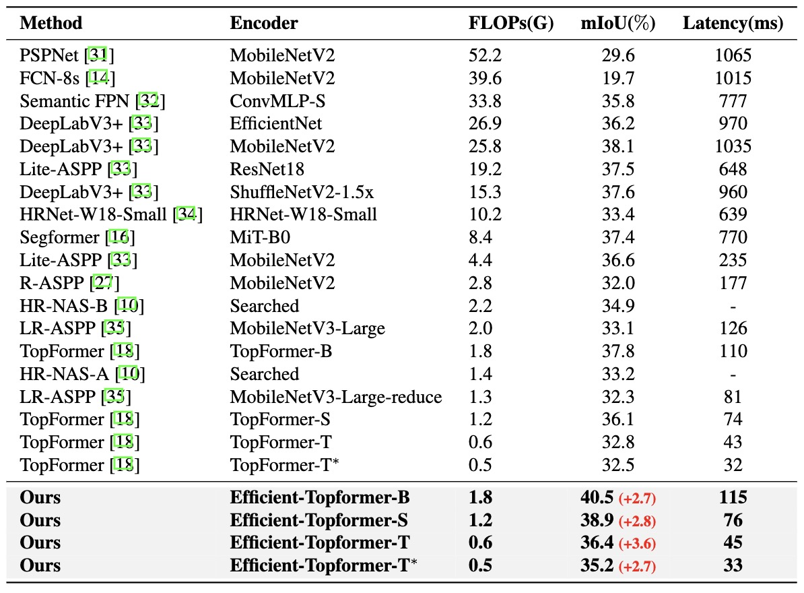
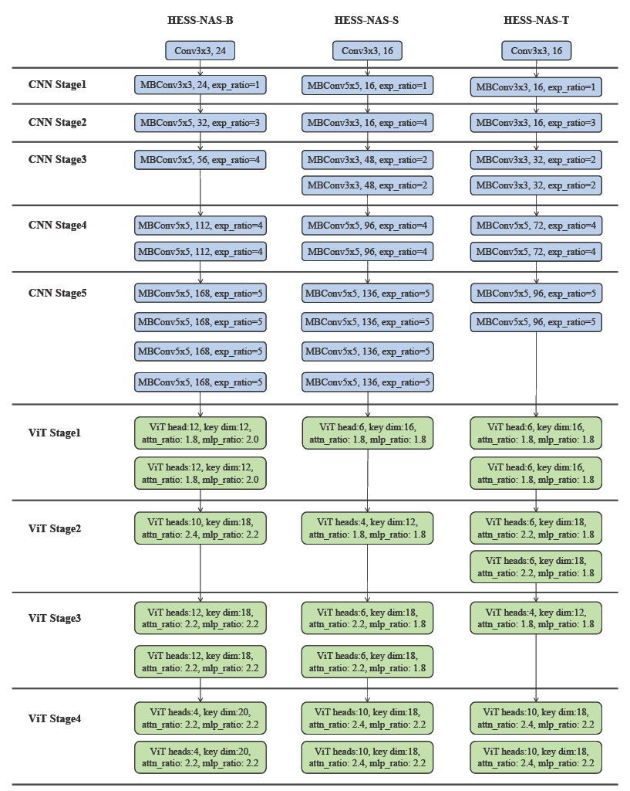

# Neural Architecture Search for Mobile Semantic Segmentation
### CS766 2024 Spring project
### Mingkai Wang, Jidong Xu, Ethan Fang

## 1 Introduction and Motivation

Neural architecture search (NAS) has been successful in designing efficient models for various tasks, such as image classification [1, 2, 3, 4, 5, 6], object detection [7, 8] and semantic segmentation [9, 10]. Considering the great progress of transformer-based architectures in the literature [11, 12, 13], we conclude that searching for effective semantic segmentation needs improvements in search space, performance estimation and search algorithm to further promote the performance.

More specifically, we discuss and solve two important problems in this paper. The first problem is: **How to design the search space for effective semantic segmentation?** The typical workflow of semantic segmentation methods [14, 15, 16] use a encoder-decoder architecture. The encoder usually adopts an image classification network to take the high-resolution images as input and output a high-level feature representation. And then, the decoder uses the low-resolution feature maps from the encoder, gradually increasing the size of the feature map for the final prediction. 

A number of approaches [17, 16, 18] propose to replace the CNN-based encoder using transformer layers to model global interactions of all pixels in the feature map. While CNNs are computationally efficient, they lack the ability to model global interactions, whereas Vision Transformers (ViT) use global self-attention on high-resolution tokens, which can be computationally expensive due to the quadratic complexity of the number of tokens. To fully take advantage of both CNNs and ViT, we propose a search space consisting of a sequential combination of CNN and ViT. First, a few CNN-based modules process high-resolution images to generate local pyramid features. Then, a ViT-based module takes these features as input and captures a full-image receptive field and rich semantics. This combination yields a simple decoder with excellent performance, as demonstrated in recent work such as TopFormer [18].

After determining the search space, it raises another problem: **How to search the optimal architecture in such HESS?** To efficiently search for the optimal architecture in the heterogeneous supernet, we propose a novel Coordinate Descent Search (CDS) method. Coordinate descent is an optimization algorithm that minimizes a function along coordinate directions. In each iteration, it selects a coordinate using a coordinate selection rule and minimizes over the corresponding coordinate hyperplane while fixing all other coordinates. We apply this method to alternately search for the optimal architecture of the CNN and ViT parts in the supernet. The optimal architecture composed of CNN and ViT is obtained through this iterative search process.

As shown in Figure 1, the NAS model searched by our algorithm can achieve the best accuracy vs. FLOPs trade-off. To summarize, we contribute in terms of search space, performance estimation and search algorithm as follows:

-   We design a new search space for efficient semantic segmentation that combines the strengths and mitigates the weaknesses of different architectures. Specifically, we use CNN to extract local features efficiently in the front layers, while utilizing ViT with a full-image receptive field to capture rich semantics. This design achieves a accuracy-efficiency trade-off. 
    
-   We proposed a novel CDS method to efficiently explore the proposed search space. This method is both simple and effective, allowing for quick convergence in problems where computing gradients is infeasible (e.g. architecture search).

      Figure 1: The latency, mIoU performance versus model size on the ADE20K val set. Our methods achieve a better accuracy-latency trade-off. The latency is measured on a single Qualcomm Snapdragon 865 with input size 512×512, and only an ARM CPU core is used for speed testing. * indicates the input size is 448×448.

## 2 Related Work and Background

Before presenting our method, we first briefly review the background of the Supernet-Based NAS [19, 3, 20, 4, 21] and efficient ViT in semantic segmentation [18].

### 2.1 Supernet-Based NAS

Supernet-Based NAS typically adopts a weight sharing strategy [19, 20, 4]. The architecture search space \\(\mathcal{A}\\) is encoded into a supernet \\(\mathcal{N}(\mathcal{A}, W)\\), where \\(W\\) is the weight of the supernet and is shared across all the candidate architectures. The search for the optimal architecture \\(\alpha^*\\) in One-shot NAS is usually formulated as a two-stage optimization problem. The first stage is to optimize the weight \\(W\\) by 

$$
W_{\mathcal{A}}=\underset{W}{\arg \min } \mathcal{L}_{\text {train}}(\mathcal{N}(\mathcal{A}, W)),
$$

where \\(\mathcal{L}\_{\text{train}}\\) represents the loss function on the training dataset. To reduce memory usage, supernet-based methods usually sample sub-networks from \\(\mathcal{N}\\) for optimization. The second stage is to search architectures by ranking the performance
of subnets \\(\alpha \in \mathcal{A}\\) based on the weights in \\(W\_{\mathcal{A}}\\):

$$
\alpha^*=\underset{\alpha \in \mathcal{A}}{\arg \max } Acc_{\text {val }}(\mathcal{N}(\alpha, w)),
$$

where the sampled subnet \\(\alpha\\) inherits weight \\(w\\) from \\(W_{\mathcal{A}}\\), and \\(Acc_{\text {val}}\\) indicates the accuracy of the architecture \\(\alpha\\) on the validation dataset. As it is impossible to enumerate all the architectures \\(\alpha \in \mathcal{A}\\) for evaluation, prior works use random search [22], evolution algorithms [19] or reinforcement learning [23] to find the most promising one. 

OFA [3] proposes a progressive training approach where a single full network is pre-trained and then distilled to obtain smaller networks. BigNAS [24] simultaneously optimizes the supernet and sub-networks for each mini-batch using a sandwich sampling rule and inplace knowledge distillation (KD). 
AttentiveNAS [25] uses a sampling strategy to identify the networks on the Pareto during training for better performance Pareto.

### 2.2 Efficient vision transformers in semantic segmentation {#architecture}

The recent work TopFormer [18] is a lightweight vision transformer for mobile semantic segmentation that consists of four parts: Token Pyramid Module, Semantics Extractor, Semantics Injection Module and Segmentation Head. 

The Token Pyramid Module is built using a few CNN-based modules (*i.e.* MobileNetV2 blocks) that quickly produce local features pyramid from high-resolution images with a fast down-sampling strategy.  

To obtain rich semantics and a large receptive field, ViT-based Semantics Extractor takes tokens as input and uses average pooling to reduce their number for computational efficiency. Unlike ViT [11] and LeViT [13] use the last output of the embedding layer as input, TopFormer pools tokens from different scales and concatenates them along the channel dimension. The new tokens are fed into the Transformer to produce global semantics. Due to the residual connections, the learned semantics are related to scales of tokens, denoted as scale-aware global semantics. 

Finally, TopFormer splits scale-aware global semantics by channels of tokens from different scales, fuses them with corresponding tokens in the Semantics Injection Module to augment representation, and uses the resulting augmented tokens as input for the segmentation head, resulting in the final per-pixel prediction.

## 3 Methodology

The overview of Efficient-Topformer is illustrated in Figure 2, which aims to find an efficient model for semantic segmentation. We design a new search space that takes advantage of both CNN and ViT (Sec 31.). Additionally, to fully utilize the supernets, we proposed Coordinate Descent Search to search the optimal model (Sec 3.2).

      Figure 2: Overview of the proposed Efficient-Topformer. Left: the search space. Right: the search pipeline. The search space consists of CNN part and ViT part. In addition, we propose Coordinate Descend Search method to iteratively search for the optimal architecture.

### 3.1 Search Space Design

This paper aims to find a model achieving a better trade-off between accuracy and efficiency in semantic segmentation. To this end, an efficient search space is needed for exacting features effectively. Among the existing architectures, CNNs [26, 27] are well known to extract local features efficiently. Meanwhile, ViTs [11, 12, 13, 28, 29, 30] are capable of providing rich semantics with full-image receptive fields, but require high computational resources. To address this, we consider using CNN in the front layers of the network and ViT in the latter layers.  To explain, the task of semantic segmentation is usually accompanied by a large input. Therefore, we need to maintain an effective feature extraction, in which the CNN is adopted in the corresponding layers. 
When the feature size is reduced by CNN, we employ ViT to obtain rich semantic information.

We followed NASViT to construct a CNN-ViT supernet in semantic segmentation. To maintain efficiency, we propose to use CNN solely for producing local feature pyramids efficiently in the backbone and leverage ViT for obtaining rich semantics and a large receptive field after the backbone, avoiding a search space increase and improving the overall architecture's efficiency.

Therefore, we partition the large-scale search space into two parts (*i.e.* CNN \& ViT), which is elaborated in Table 1.  Following the design of BigNAS [24], we search the optimal channel width, block depth, expansion ratios and kernel size in CNN component. For the ViT component, we design the search space to include 5 variable factors: key dimension, value dimension, number of heads, MLP ratio, and block depth.

      Table 1: The search space of Efficient-Topformer. Tuples of three values in parentheses represent the lowest value, the highest value, and steps. Note: Query dim = Key dim, Value dim = Attention ratio &times; Key dim .

### 3.2 Coordinate Descent Search

In addition, we introduce a novel algorithm for searching in this heterogeneous supernet. As we know, NAS essentially involves a black-box optimization process based on a discrete space, with the architecture as the variable and accuracy on validation dataset as the objective. When the search space is divided, the optimization problem can be viewed as a multi-variate optimization problem, where the variables are the architectures of different parts. We formulate this optimization problem as follows:

$$
\alpha^*=\underset{\alpha_A \in \mathcal{A}_\text{CNN}, \alpha_B \in \mathcal{A}_\text{ViT}}{\arg \max } \operatorname{Acc}_{\text {val }}(\mathcal{N}(\alpha_{\text{A}}, \alpha_{\text{B}}))
$$

We further propose to utilize a Coordinate Descent Search (CDS) method to obtain the optimal architecture.
The core idea of coordinate descent is to decompose a complex optimization problem into a series of simpler optimization problems, which can be solved iteratively. In cyclic coordinate descent, one iterates through the directions, minimizing the objective function with respect to each coordinate direction one at a time. This involves starting with an initial variable value
\\(\mathbf{x}^0=\left(x_1^0, \ldots, x_n^0\right)\\) from round \\(k+1\\) defines \\(x^{k+1}\\) from \\(x^{k}\\) by iteratively solving the single variable optimization problems \\(x_i^{k+1}=\underset{u \in \mathbb{R}}{\arg \min } f\left(x_1^{k+1}, \ldots, x_{i-1}^{k+1}, y, x_{i+1}^k, \ldots, x_n^k\right)\\) for each variable \\(x_{i}\\) of \\(\mathbf{x}\\) , for \\(\textit{i}\\) from 1 to \\(\textit{n}\\). Thus, starting with an initial guess \\(x^{0}\\) for a local minimum of \\(F\\), one obtains an iterative sequence of variable values, \\(\mathbf{x}^0, \mathbf{x}^1, \mathbf{x}^2\\), \\(\ldots\\) iteratively.

In order to effectively search for the optimal CNN sub-network and optimal ViT sub-network, we perform an alternate search for the best architecture of CNN part and ViT part during the search process. Specifically, we start by randomly sampling a network architecture \\(\alpha^0 = (\alpha^0\_{\text{A}}, \alpha^0\_{\text{B}})\\) under the FLOPs constraint. In the subsequent search round \\(\textit{k}+1\\), we keep CNN part \\(\alpha^k_{\text{A}}\\) fixed and sample the ViT part \\(\alpha^{k+1}\_{\text{B}}\\) to search the optimal architecture of ViT part in supernet \\(\mathcal{N}\\), which can be formulated as

$$
\alpha^{k+1 *}_{\text{B}}=\underset{\alpha_{\text{B}} \in \mathcal{A}_\text{ViT}}{\arg \max }  \operatorname{Acc}_{\text {val }}(\mathcal{N}(\alpha^k_{\text{A}},\alpha_{\text{B}}))
$$

After obtaining the optimal ViT sub-network architecture in the previous step, we fixed the ViT part \\(\alpha^{k+1}\_{\text{B}}\\) and sample the CNN part \\(\alpha^{k+1}_{\text{A}}\\) for the optimal CNN architecture in supernet \\(\mathcal{N}\\), which can be represented as

$$
\alpha^{k+1 *}_{\text{A}}=\underset{\alpha_{\text{A}} \in \mathcal{A}_\text{CNN}}{\arg \max }  \operatorname{Acc}_{\text{val}}(\mathcal{N}(\alpha_{\text{A}},\alpha^{k+1}_{\text{B}})))
$$

In this way, we only need to search for a single part (either CNN or ViT) in the supernet once in a single iteration. 
Coordinate Descent Search (CDS) method is used to achieve this by breaking down the large and heterogeneous search space into smaller and more homogeneous ones. CDS reduces the number of dimensions to search in each iteration, resulting in faster convergence and more accurate performance estimation than other search methods such as random search and evolutionary search.
% To avoid the sampled sub-network perform not well in performance estimation due to not being sampled in the supernet, we finetune the sampled sub-network a few iterations to recover the accuracy before every evaluation. 
After such iterative search process, we obtain the entire optimal sub-network under resource constraints. Finally, we retrain the sub-network on ImageNet and fine-tune it on specific semantic segmentation dataset. The overall algorithm is summarized in Algorithm 1.

## 4 Experiments

In this section, we first describe the semantic segmentation datasets and implementation details of training and search process. Then, we present the performance of Efficient-Topformer evaluated on these datasets. Finally, we conduct ablation studies to analyze the effectiveness of our method. 

### 4.1 Datasets

We perform experiments on two datasets, ADE20K [36] and COCO-Stuff [37], using mean of class-wise intersection over union (mIoU) as the evaluation metric. All the models are converted to [TNN: A high-performance, lightweight neural network inference framework.](https://github.com/Tencent/TNN) for latency measurement on an ARM-based computing core. **ADE20K**: The ADE20K dataset contains 25K images, covering 150 categories. All images are split into 20K/2K/3K for training, validation, and testing. **COCO-Stuff**: The COCO-Stuff [37] dataset contains 10000 complex images selected from COCO, with 9K in the training set and 1K in the test set.

### 4.2 Implementation Details

Our implementation is based on MMSegmentation [38] and Pytorch. The supernet is pre-trained on ImageNet for 300 epochs following BigNAS [24], and fine-tuned on ADE20K for 160K iterations. During the search process, we use the FLOPs as the resource constraint. The search process involves 5 iterations, with 500 CNN and 500 ViT architectures sampled in each iteration. For each sampled sub-network, we calibrate the batch norm statistics before evaluation using 32 images from the ADE20K training set. The training and finetuning process of the two supernets cost about 15 days on 8 Nvidia V100 GPUs. The search process cost about 3 days on a single Nvidia V100 GPU, which is 300+ times less than some reinforcement learning and genetic search methods [39, 40].

### 4.3 Main Results

We perform the proposed Efficient-Topformer and find multiple models with diverse FLOPs constraints. The models were retrained on ImageNet and fine-tuned on specific semantic segmentation datasets. The results on ADE20K validation set are reported in Table 2. 

      Table 2: Results on ADE20K <em>val</em> set. Latency and FLOPs calculation adopt images with 512 &times; 512 resolution as input. * indicates results are obtained with 448 &times; 448 resolution as input. Latency is measured based on a single Qualcomm Snapdragon 865 processor. The mIoU is reported with single-scale inference.

Latency is measured on a mobile device with a single Qualcomm Snapdragon 865 processor. Our Efficient-Topformer model family achieves higher accuracy than the other methods with similar or lower FLOPs, including DeepLabV3+ [33], HR-NAS [10], Segformer [16], and TopFormer [18]. In particular, our base model, Efficient-Topformer-B, achieves a mIoU of 40.5\\(\%\\) using 1.8G FLOPs, which is 2.7\\(\%\\) higher than TopFormer-B with similar FLOPs and latency. Our models outperform TopFormer by 2.8\\(\%\\) and 3.6\\(\%\\) with FLOPs of 1.2G and 1.6G, respectively. Moreover, Efficient-Topformer-T achieves real-time inference with a mIoU of 35.24\\(\%\\) when the input resolution is 448 \\(\times\\) 448, which is 2.7\\(\%\\) higher than TopFormer-T.

We further evaluate Efficient-Topformer on COCO-Stuff val set which is shown in Table 3. It can be seen that the base version of Efficient-Topformer achieves 34.64\\(\%\\) mIoU with 1.8G FLOPs, while outperforming TopFormer-B, by a mIoU of 1.21\\(\%\\) with the same FLOPs. It is shown that our approach achieves a better accuracy-efficiency trade-off than other previous approaches.

      Table 3: Results on COCO-Stuff <em>val</em> set. FLOPs calculation adopt images with 512 &times; 512 resolution as input. The mIoU is reported with single-scale inference.

### 4.4 Searched Network Architecture

We show the architecture visualization of the searched models Efficient-Topformer-B, Efficient-Topformer-S, Efficient-Topformer-T in Figure 3. For brevity, we only visualize the CNN and ViT part of different sub-networks.

Figure 3: Architecture visualization of the models Efficient-Topformer-B, Efficient-Topformer-S, Efficient-Topformer-T.

The architecture of Efficient-Topformer base model is a combination of a small CNN and a large ViT, with a total of 1.8G FLOPs. The CNN architecture has many channels and a large kernel size to facilitate rich feature learning, while maintaining a small depth and expand ratio for improved efficiency. The ViT component employs a large number of heads, QKV dimension, and depth to capture the full-image receptive field and model global interactions. This hybrid architecture balances accuracy and efficiency by leveraging the strengths of both CNN and ViT. The details of the architectures are provided in the supplementary materials.

## 5 Visualization

We present some visualization comparisons between TopFormer-B and the proposed Efficient-Topformer on the ADE20K validation (val) set. As shown in Figure 4, the proposed method could achieve better segmentation results than TopFormer-B.

Figure 4: The visualization comparisons of the TopFormer-B and the proposed Efficient-Topformer on ADE20K val set. We use Efficient-Topformer-B to conduct visualization.

## 6 Conclusion

In this work, we propose a novel architecture search method for effective semantic segmentation, named Efficient-Topformer. Specifically, we first propose a search space that takes advantage of CNN and ViT simultaneously. To further search in the search space, we propose a Coordinate Descent Search method, which is beneficial to search for the optimal architecture in the aforementioned search spaces. Extensive experiments demonstrate that the searched models outperform other methods under various FLOPs constraints.

## References

1. Hanxiao Liu, Karen Simonyan, and Yiming Yang. Darts: Differentiable architecture search. arXiv preprint arXiv:1806.09055, 2018.
2. Sirui Xie, Hehui Zheng, Chunxiao Liu, and Liang Lin. Snas: stochastic neural architecture search. arXiv preprint arXiv:1812.09926, 2018.
3. Han Cai, Chuang Gan, Tianzhe Wang, Zhekai Zhang, and Song Han. Once-for-all: Train one network and specialize it for efficient deployment. arXiv preprint arXiv:1908.09791, 2019.
4. Xiawu Zheng, Rongrong Ji, Yuhang Chen, Qiang Wang, Baochang Zhang, Jie Chen, Qixiang Ye, Feiyue Huang, and Yonghong Tian. Migo-nas: Towards fast and generalizable neural architecture search. IEEE Transactions on Pattern Analysis and Machine Intelligence, 2021.
5. Xiawu Zheng, Rongrong Ji, Qiang Wang, Qixiang Ye, Zhenguo Li, Yonghong Tian, and Qi Tian. Rethinking performance estimation in neural architecture search. In Proceedings of the IEEE/CVF Conference on Computer Vision and Pattern Recognition, pages 11356–
   11365, 2020.
6. Xiawu Zheng, Yang Zhang, Sirui Hong, Huixia Li, Lang Tang, Youcheng Xiong, Jin Zhou, Yan Wang, Xiaoshuai Sun, Pengfei Zhu, et al. Evolving fully automated machine learning via life-long knowledge anchors. IEEE Transactions on Pattern Analysis and Machine Intelligence, 43(9):3091–3107, 2021.
7. Golnaz Ghiasi, Tsung-Yi Lin, and Quoc V Le. Nas-fpn: Learning scalable feature pyramid architecture for object detection. In Proceedings of the IEEE/CVF conference on computer vision and pattern recognition, pages 7036–7045, 2019.
8. Yukang Chen, Tong Yang, Xiangyu Zhang, Gaofeng Meng, Xinyu Xiao, and Jian Sun. Detnas: Backbone search for object detection. Advances in Neural Information Processing Systems, 32, 2019.
9. Chenxi Liu, Liang-Chieh Chen, Florian Schroff, Hartwig Adam, Wei Hua, Alan L Yuille, and Li Fei-Fei. Auto-deeplab: Hierarchical neural architecture search for semantic image segmentation. In Proceedings of the IEEE/CVF conference on computer vision and pattern recognition, pages 82–92, 2019.
10. Mingyu Ding, Xiaochen Lian, Linjie Yang, Peng Wang, Xiaojie Jin, Zhiwu Lu, and Ping Luo. Hr-nas: Searching efficient high-resolution neural architectures with lightweight transformers. In Proceedings of the IEEE/CVF Conference on Computer Vision and Pattern Recognition, pages 2982–2992, 2021.
11. Alexey Dosovitskiy, Lucas Beyer, Alexander Kolesnikov, Dirk Weissenborn, Xiaohua Zhai, Thomas Unterthiner, Mostafa Dehghani, Matthias Minderer, Georg Heigold, Sylvain Gelly, et al. An image is worth 16x16 words: Transformers for image recognition at scale. arXiv preprint arXiv:2010.11929, 2020.
12. Ze Liu, Yutong Lin, Yue Cao, Han Hu, Yixuan Wei, Zheng Zhang, Stephen Lin, and Baining Guo. Swin transformer: Hierarchical vision transformer using shifted windows. In Proceedings of the IEEE/CVF International Conference on Computer Vision, pages 10012–10022, 2021.
13. Benjamin Graham, Alaaeldin El-Nouby, Hugo Touvron, Pierre Stock, Armand Joulin, Herv ́e J ́egou, and Matthijs Douze. Levit: a vision transformer in convnet’s clothing for faster inference. In Proceedings of the IEEE/CVF international conference on computer vision, pages 12259–12269, 2021.
14. Jonathan Long, Evan Shelhamer, and Trevor Darrell. Fully convolutional networks for semantic segmentation. In Proceedings of the IEEE conference on computer vision and pattern recognition, pages 3431–3440, 2015.
15. Olaf Ronneberger, Philipp Fischer, and Thomas Brox. U-net: Convolutional networks for biomedical image segmentation. In International Conference on Medical image computing and computer-assisted intervention, pages 234–241. Springer, 2015.
16. Enze Xie, Wenhai Wang, Zhiding Yu, Anima Anandkumar, Jose M Alvarez, and Ping Luo. Segformer: Simple and efficient design for semantic segmentation with transformers. Advances in Neural Information Processing Systems, 34:12077–12090, 2021.
17. Sixiao Zheng, Jiachen Lu, Hengshuang Zhao, Xiatian Zhu, Zekun Luo, Yabiao Wang, Yanwei Fu, Jianfeng Feng, Tao Xiang, Philip HS Torr, et al. Rethinking semantic segmentation from a sequence-to-sequence perspective with transformers. In Proceedings of the IEEE/CVF conference on computer vision and pattern recognition, pages 6881–6890, 2021.
18. Wenqiang Zhang, Zilong Huang, Guozhong Luo, Tao Chen, Xinggang Wang, Wenyu Liu, Gang Yu, and Chunhua Shen. Topformer: Token pyramid transformer for mobile semantic segmentation. In Proceedings of the IEEE/CVF Conference on Computer Vision and Pattern Recognition, pages 12083–12093, 2022.
19. Zichao Guo, Xiangyu Zhang, Haoyuan Mu, Wen Heng, Zechun Liu, Yichen Wei, and Jian Sun. Single path one-shot neural architecture search with uniform sampling. In European conference on computer vision, pages 544–560. Springer, 2020.
20. Houwen Peng, Hao Du, Hongyuan Yu, Qi Li, Jing Liao, and Jianlong Fu. Cream of the crop: Distilling prioritized paths for one-shot neural architecture search. Advances in Neural Information Processing Systems, 33:17955–17964, 2020.
21. Xin Xia, Xuefeng Xiao, Xing Wang, and Min Zheng. Progressive automatic design of search space for one-shot neural architecture search. In Proceedings of the IEEE/CVF Winter Conference on Applications of Computer Vision, pages 2455–2464, 2022.
22. Gabriel Bender, Pieter-Jan Kindermans, Barret Zoph, Vijay Vasudevan, and Quoc Le. Understanding and simplifying one-shot architecture search. In International conference on machine learning, pages 550–559. PMLR, 2018.
23. Hieu Pham, Melody Guan, Barret Zoph, Quoc Le, and Jeff Dean. Efficient neural architecture search via parameters sharing. In International conference on machine learning, pages 4095–4104. PMLR, 2018.
24. Jiahui Yu, Pengchong Jin, Hanxiao Liu, Gabriel Bender, Pieter-Jan Kindermans, Mingxing Tan, Thomas Huang, Xiaodan Song, Ruoming Pang, and Quoc Le. Bignas: Scaling up neural architecture search with big single-stage models. In European Conference on Computer Vision, pages 702–717. Springer, 2020.
25. Dilin Wang, Meng Li, Chengyue Gong, and Vikas Chandra. Attentivenas: Improving neural architecture search via attentive sampling. In Proceedings of the IEEE/CVF Conference on Computer Vision and Pattern Recognition, pages 6418–6427, 2021.
26. Kaiming He, Xiangyu Zhang, Shaoqing Ren, and Jian Sun. Deep residual learning for image recognition. In Proceedings of the IEEE conference on computer vision and pattern recognition, pages 770–778, 2016.
27. Mark Sandler, Andrew Howard, Menglong Zhu, Andrey Zhmoginov, and Liang-Chieh Chen. Mobilenetv2: Inverted residuals and linear bottlenecks. In Proceedings of the IEEE conference on computer vision and pattern recognition, pages 4510–4520, 2018.
28. Wei Li, Xing Wang, Xin Xia, Jie Wu, Xuefeng Xiao, Min Zheng, and Shiping Wen. Sepvit: Separable vision transformer. arXiv preprint arXiv:2203.15380, 2022.
29. Xin Xia, Jiashi Li, Jie Wu, Xing Wang, Mingkai Wang, Xuefeng Xiao, Min Zheng, and Rui Wang. Trt-vit: Tensorrt-oriented vision transformer. arXiv preprint arXiv:2205.09579, 2022.
30. Jiashi Li, Xin Xia, Wei Li, Huixia Li, Xing Wang, Xuefeng Xiao, Rui Wang, Min Zheng, and Xin Pan. Next-vit: Next generation vision transformer for efficient deployment in realistic industrial scenarios. arXiv preprint arXiv:2207.05501, 2022.
31. Hengshuang Zhao, Jianping Shi, Xiaojuan Qi, Xiaogang Wang, and Jiaya Jia. Pyramid scene parsing network. In Proceedings of the IEEE conference on computer vision and pattern recognition, pages 2881–2890, 2017.
32. Nicolas Carion, Francisco Massa, Gabriel Synnaeve, Nicolas Usunier, Alexander Kirillov, and Sergey Zagoruyko. End-to-end object detection with transformers. In European conference on computer vision, pages 213–229. Springer, 2020.
33. Liang-Chieh Chen, Yukun Zhu, George Papandreou, Florian Schroff, and Hartwig Adam. Encoder-decoder with atrous separable convolution for semantic image segmentation. In Proceedings of the European conference on computer vision (ECCV), pages 801–818, 2018.
34. Yuhui Yuan, Xilin Chen, and Jingdong Wang. Object-contextual representations for semantic segmentation. In European conference on computer vision, pages 173–190. Springer, 2020.
35. Andrew Howard, Mark Sandler, Grace Chu, Liang-Chieh Chen, Bo Chen, Mingxing Tan, Weijun Wang, Yukun Zhu, Ruoming Pang, Vijay Vasudevan, et al. Searching for mobilenetv3. In Proceedings of the IEEE/CVF international conference on computer vision, pages 1314–1324, 2019.
36. Bolei Zhou, Hang Zhao, Xavier Puig, Sanja Fidler, Adela Barriuso, and Antonio Torralba. Scene parsing through ade20k dataset. In Proceedings of the IEEE conference on computer vision and pattern recognition, pages 633–641, 2017.
37. Holger Caesar, Jasper Uijlings, and Vittorio Ferrari. Coco-stuff: Thing and stuff classes in context. In Proceedings of the IEEE conference on computer vision and pattern recognition, pages 1209–1218, 2018.
38. MMSegmentation Contributors. MMSegmentation: Openmmlab semantic segmentation toolbox and benchmark. https://github.com/open-mmlab/mmsegmentation, 2020.
39. Barret Zoph and Quoc V Le. Neural architecture search with reinforcement learning. arXiv preprint arXiv:1611.01578, 2016.
40. Barret Zoph, Vijay Vasudevan, Jonathon Shlens, and Quoc V Le. Learning transferable architectures for scalable image recognition. In Proceedings of the IEEE conference on computer vision and pattern recognition, pages 8697–8710, 2018.
