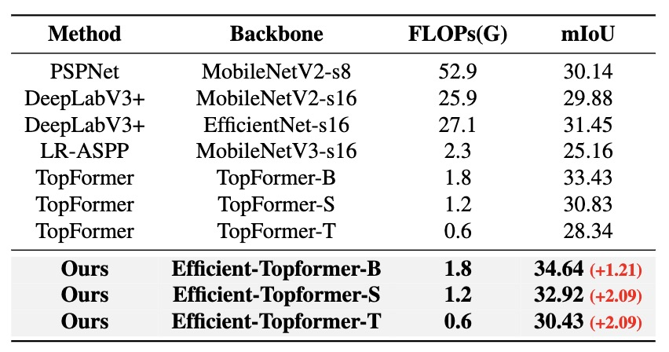

# Neural Architecture Search for Mobile Semantic Segmentation

### CS766 2024 Spring project

### Mingkai Wang, Jidong Xu, Ethan Fang

## 1 Introduction and Motivation

Neural architecture search (NAS) has proven effective in crafting streamlined models across diverse domains like image classification [1, 2, 3, 4, 5, 6], object detection [7, 8], and semantic segmentation [9, 10]. Considering the substantial strides made by transformer-based architectures in the field [11, 12, 13], it's evident that refining the search space, performance estimation, and search algorithms is crucial for advancing semantic segmentation effectiveness.

In this paper, we tackle two pivotal issues. The first query is: **How can we optimize the search space for proficient semantic segmentation?** Traditional semantic segmentation methods [14, 15, 16] typically employ an encoder-decoder framework. The encoder leverages an image classification network to process high-resolution images into a high-level feature representation. Subsequently, the decoder utilizes these features to progressively upscale the feature map for final prediction.

Several strategies [17, 16, 18] propose replacing the CNN-based encoder with transformer layers to capture global interactions among all pixels in the feature map. While CNNs are computationally efficient, they lack global interaction modeling, unlike Vision Transformers (ViT) which employ global self-attention on high-resolution tokens. However, ViT's computational overhead due to quadratic complexity impedes its practicality. To harness the strengths of both CNNs and ViT, we propose a hybrid search space comprising a sequential fusion of CNN and ViT. Initially, a few CNN-based modules process high-resolution images to generate localized pyramid features. Subsequently, a ViT-based module ingests these features to capture a holistic image context and nuanced semantics. This amalgamation yields a streamlined decoder with impressive performance, as evidenced by recent work such as TopFormer [18].

Having defined the search space, another question emerges: **How do we search for the optimal architecture within this Hybrid Search Space?** To efficiently navigate the heterogeneous supernet for the optimal architecture, we introduce a novel Coordinate Descent Search (CDS) method. Coordinate descent is an optimization algorithm that minimizes a function along coordinate axes. At each iteration, it selects a coordinate according to a predefined rule and minimizes along the corresponding axis while holding other coordinates constant. We employ this method to iteratively search for the optimal architecture of the CNN and ViT segments within the supernet. Through this iterative exploration, we derive the optimal architecture composed of CNN and ViT components.

The NAS model unearthed by our algorithm achieves an optimal balance between accuracy and computational complexity. To recap, our contributions encompass:

* Designing a novel search space for efficient semantic segmentation, amalgamating the strengths of diverse architectures while mitigating their weaknesses. We employ CNNs for efficient local feature extraction in the initial layers, while leveraging ViT for holistic image understanding, striking a balance between accuracy and efficiency.
* Introducing a novel CDS method to efficiently traverse the proposed search space. This method, simple yet effective, facilitates swift convergence in scenarios where computing gradients is impractical, such as architecture search.

## 2 Related Work and Background

Before presenting our method, we first briefly review the background of the Supernet-Based NAS [19, 3, 20, 4, 21] and efficient ViT in semantic segmentation [18].

### 2.1 Supernet-Based NAS

Supernet-Based NAS typically adopts a weight sharing strategy [19, 20, 4]. The architecture search space \\(\mathcal{A}\\) is encoded into a supernet \\(\mathcal{N}(\mathcal{A}, W)\\), where \\(W\\) is the weight of the supernet and is shared across all the candidate architectures. The search for the optimal architecture \\(\alpha^*\\) in One-shot NAS is usually formulated as a two-stage optimization problem. The first stage is to optimize the weight \\(W\\) by

$$
W_{\mathcal{A}}=\underset{W}{\arg \min } \mathcal{L}_{\text {train}}(\mathcal{N}(\mathcal{A}, W)),
$$

where \\(\mathcal{L}\_{\text{train}}\\) represents the loss function on the training dataset. To reduce memory usage, supernet-based methods usually sample sub-networks from \\(\mathcal{N}\\) for optimization. The second stage is to search architectures by ranking the performance
of subnets \\(\alpha \in \mathcal{A}\\) based on the weights in \\(W\_{\mathcal{A}}\\):

$$
\alpha^*=\underset{\alpha \in \mathcal{A}}{\arg \max } Acc_{\text {val }}(\mathcal{N}(\alpha, w)),
$$

where the sampled subnet \\(\alpha\\) inherits weight \\(w\\) from \\(W_{\mathcal{A}}\\), and \\(Acc_{\text {val}}\\) indicates the accuracy of the architecture \\(\alpha\\) on the validation dataset. As it is impossible to enumerate all the architectures \\(\alpha \in \mathcal{A}\\) for evaluation, prior works use random search [22], evolution algorithms [19] or reinforcement learning [23] to find the most promising one.

OFA [3] proposes a progressive training approach where a single full network is pre-trained and then distilled to obtain smaller networks. BigNAS [24] simultaneously optimizes the supernet and sub-networks for each mini-batch using a sandwich sampling rule and inplace knowledge distillation (KD).
AttentiveNAS [25] uses a sampling strategy to identify the networks on the Pareto during training for better performance Pareto.

### 2.2 Efficient vision transformers in semantic segmentation

The recent development, TopFormer [18], introduces a lightweight vision transformer tailored for mobile semantic segmentation, comprising four integral components: the Token Pyramid Module, Semantics Extractor, Semantics Injection Module, and Segmentation Head.

The Token Pyramid Module employs a set of CNN-based modules, such as MobileNetV2 blocks, to swiftly generate a local feature pyramid from high-resolution images through a rapid down-sampling approach.

For capturing rich semantics and expanding the receptive field, the ViT-based Semantics Extractor processes tokens via average pooling to streamline computational efficiency. Unlike conventional approaches like ViT [11] and LeViT [13], which utilize the last output of the embedding layer, TopFormer adopts a distinctive method. It aggregates tokens from various scales, concatenating them along the channel dimension before inputting them into the Transformer to derive global semantics. Thanks to residual connections, the acquired semantics are intricately linked to token scales, characterized as scale-aware global semantics.

Subsequently, TopFormer dissects the scale-aware global semantics into channel-specific tokens from diverse scales, integrating them with corresponding tokens in the Semantics Injection Module to enhance representation. The resultant augmented tokens serve as input for the segmentation head, culminating in precise per-pixel predictions.

## 3 Methodology

The schematic of Efficient-Topformer, depicted in Figure 1, is devised with the objective of crafting an efficient model for semantic segmentation. We introduce a novel search space leveraging the strengths of both CNN and ViT architectures (Section 3.1). Furthermore, to maximize the utility of the supernets, we introduce the Coordinate Descent Search method for the exploration of the optimal model (Section 3.2).

Figure 1: Overview of the proposed Efficient-Topformer. Left: the search space. Right: the search pipeline. The search space consists of CNN part and ViT part. In addition, we propose Coordinate Descend Search method to iteratively search for the optimal architecture.

### 3.1 Search Space Design

This paper aims to develop a model that strikes a better balance between accuracy and efficiency in semantic segmentation. To achieve this goal, it's crucial to devise an efficient search space for precise feature extraction. Among existing architectures, CNNs [26, 27] are renowned for their ability to efficiently extract local features. Conversely, ViTs [11, 12, 13, 28, 29, 30] excel in providing rich semantics with expansive receptive fields but demand significant computational resources. To address this challenge, we propose a hybrid approach: employing CNNs in the initial layers of the network for effective feature extraction, and ViTs in subsequent layers for capturing detailed semantics.

In semantic segmentation tasks, where inputs are often large, maintaining efficient feature extraction is essential. Thus, we incorporate CNNs in the early layers of the network to handle this task effectively. Once the feature size is reduced by CNN, ViTs are employed to capture rich semantic information.

Following the methodology of NASViT, we construct a CNN-ViT supernet for semantic segmentation. To ensure efficiency, we propose utilizing CNNs exclusively for generating local feature pyramids in the backbone, while leveraging ViTs for extracting rich semantics and expanding the receptive field beyond the backbone. This approach prevents an increase in the search space and enhances the overall architecture's efficiency.

Consequently, we partition the extensive search space into two distinct components—CNN and ViT—as detailed in Table 1. Inspired by the framework of BigNAS [24], we explore optimal channel width, block depth, expansion ratios, and kernel size within the CNN component. For the ViT component, the search space encompasses five variable factors: key dimension, value dimension, number of heads, MLP ratio, and block depth.

Table 1: The search space of Efficient-Topformer. Tuples of three values in parentheses represent the lowest value, the highest value, and steps. Note: Query dim = Key dim, Value dim = Attention ratio × Key dim .

### 3.2 Coordinate Descent Search

Furthermore, we present a novel algorithm tailored for searching within this heterogeneous supernet. As is well-known, NAS fundamentally entails a black-box optimization process within a discrete space, where the architecture serves as the variable and accuracy on the validation dataset serves as the objective. With the division of the search space, the optimization problem can be conceptualized as a multivariate optimization problem, where the variables encompass the architectures of various components. We formulate this optimization problem as follows:

$$
\alpha^*=\underset{\alpha_A \in \mathcal{A}_\text{CNN}, \alpha_B \in \mathcal{A}_\text{ViT}}{\arg \max } \operatorname{Acc}_{\text {val }}(\mathcal{N}(\alpha_{\text{A}}, \alpha_{\text{B}}))
$$

We further propose to utilize a Coordinate Descent Search (CDS) method to obtain the optimal architecture.
The core idea of coordinate descent is to decompose a complex optimization problem into a series of simpler optimization problems, which can be solved iteratively. In cyclic coordinate descent, one iterates through the directions, minimizing the objective function with respect to each coordinate direction one at a time. This involves starting with an initial variable value
\\(\mathbf{x}^0=\left(x_1^0, \ldots, x_n^0\right)\\) from round \\(k+1\\) defines \\(x^{k+1}\\) from \\(x^{k}\\) by iteratively solving the single variable optimization problems \\(x_i^{k+1}=\underset{u \in \mathbb{R}}{\arg \min } f\left(x_1^{k+1}, \ldots, x_{i-1}^{k+1}, y, x_{i+1}^k, \ldots, x_n^k\right)\\) for each variable \\(x_{i}\\) of \\(\mathbf{x}\\) , for \\(\textit{i}\\) from 1 to \\(\textit{n}\\). Thus, starting with an initial guess \\(x^{0}\\) for a local minimum of \\(F\\), one obtains an iterative sequence of variable values, \\(\mathbf{x}^0, \mathbf{x}^1, \mathbf{x}^2\\), \\(\ldots\\) iteratively.

In order to effectively search for the optimal CNN sub-network and optimal ViT sub-network, we perform an alternate search for the best architecture of CNN part and ViT part during the search process. Specifically, we start by randomly sampling a network architecture \\(\alpha^0 = (\alpha^0\_{\text{A}}, \alpha^0\_{\text{B}})\\) under the FLOPs constraint. In the subsequent search round \\(\textit{k}+1\\), we keep CNN part \\(\alpha^k_{\text{A}}\\) fixed and sample the ViT part \\(\alpha^{k+1}\_{\text{B}}\\) to search the optimal architecture of ViT part in supernet \\(\mathcal{N}\\), which can be formulated as

$$
\alpha^{k+1 *}_{\text{B}}=\underset{\alpha_{\text{B}} \in \mathcal{A}_\text{ViT}}{\arg \max }  \operatorname{Acc}_{\text {val }}(\mathcal{N}(\alpha^k_{\text{A}},\alpha_{\text{B}}))
$$

After obtaining the optimal ViT sub-network architecture in the previous step, we fixed the ViT part \\(\alpha^{k+1}\_{\text{B}}\\) and sample the CNN part \\(\alpha^{k+1}_{\text{A}}\\) for the optimal CNN architecture in supernet \\(\mathcal{N}\\), which can be represented as

$$
\alpha^{k+1 *}_{\text{A}}=\underset{\alpha_{\text{A}} \in \mathcal{A}_\text{CNN}}{\arg \max }  \operatorname{Acc}_{\text{val}}(\mathcal{N}(\alpha_{\text{A}},\alpha^{k+1}_{\text{B}})))
$$

This approach allows us to streamline the search process by focusing on a single component (either CNN or ViT) within the supernet in each iteration. The Coordinate Descent Search (CDS) method facilitates this by breaking down the large and heterogeneous search space into smaller and more homogeneous ones. By reducing the number of dimensions to search in each iteration, CDS promotes faster convergence and more accurate performance estimation compared to other search methods such as random search and evolutionary search.
To ensure that sampled sub-networks perform well in performance estimation, despite not being directly sampled from the supernet, we fine-tune each sampled sub-network for a few iterations to restore accuracy before conducting any evaluations.
Following this iterative search process, we derive the optimal sub-network within the specified resource constraints. Subsequently, we retrain the sub-network on ImageNet and fine-tune it on the specific semantic segmentation dataset. The overarching algorithm is summarized in Algorithm 1.

## 4 Experiments

In this section, we begin by providing a description of the semantic segmentation datasets used and delve into the implementation details pertaining to both the training and search processes. Subsequently, we showcase the performance of Efficient-Topformer as evaluated on these datasets. Finally, we undertake ablation studies to meticulously analyze the effectiveness of our proposed method.

### 4.1 Datasets

We conduct experiments on two datasets: ADE20K [36] and COCO-Stuff [37], utilizing the mean of class-wise intersection over union (mIoU) as the evaluation metric. All models are converted to [TNN: A high-performance, lightweight neural network inference framework](https://github.com/Tencent/TNN) for latency measurement on an ARM-based computing core.

 **ADE20K** : The ADE20K dataset comprises 25,000 images spanning 150 categories. The dataset is partitioned into training (20,000 images), validation (2,000 images), and testing (3,000 images) sets.

 **COCO-Stuff** : The COCO-Stuff [37] dataset comprises 10,000 complex images extracted from COCO. The training set contains 9,000 images, while the test set contains 1,000 images.

### 4.2 Implementation Details

Our implementation is built upon MMSegmentation [38] and PyTorch. The supernet is initially pre-trained on ImageNet for 300 epochs, following the methodology of BigNAS [24], and subsequently fine-tuned on ADE20K for 160,000 iterations.

During the search process, we utilize the FLOPs as the resource constraint. The search process comprises 5 iterations, with 500 architectures sampled in each iteration. For each sampled sub-network, we calibrate the batch norm statistics before evaluation using 32 images from the ADE20K training set.

The training and fine-tuning processes of the supernets collectively take approximately one week to complete, utilizing 8 Nvidia V100 GPUs. In contrast, the search process requires about 3 days on a single Nvidia V100 GPU, which is over 300 times less than the computational cost incurred by certain reinforcement learning and genetic search methods [39, 40].

### 4.3 Main Results

We execute the proposed Efficient-Topformer algorithm and identify multiple models tailored to different FLOPs constraints. Subsequently, these models are retrained on ImageNet and fine-tuned on specific semantic segmentation datasets. The outcomes on the ADE20K validation set are presented in Table 2.

Table 2: Results on ADE20K <em>val</em> set. Latency and FLOPs calculation adopt images with 512 × 512 resolution as input. * indicates results are obtained with 448 × 448 resolution as input. Latency is measured based on a single Qualcomm Snapdragon 865 processor. The mIoU is reported with single-scale inference.

Latency is measured on a mobile device with a single Qualcomm Snapdragon 865 processor. Our Efficient-Topformer model family achieves higher accuracy than the other methods with similar or lower FLOPs, including DeepLabV3+ [33], HR-NAS [10], Segformer [16], and TopFormer [18]. In particular, our base model, Efficient-Topformer-B, achieves a mIoU of 40.5\\(\%\\) using 1.8G FLOPs, which is 2.7\\(\%\\) higher than TopFormer-B with similar FLOPs and latency. Our models outperform TopFormer by 2.8\\(\%\\) and 3.6\\(\%\\) with FLOPs of 1.2G and 1.6G, respectively. Moreover, Efficient-Topformer-T achieves real-time inference with a mIoU of 35.24\\(\%\\) when the input resolution is 448 \\(\times\\) 448, which is 2.7\\(\%\\) higher than TopFormer-T.

We further evaluate Efficient-Topformer on COCO-Stuff val set which is shown in Table 3. It can be seen that the base version of Efficient-Topformer achieves 34.64\\(\%\\) mIoU with 1.8G FLOPs, while outperforming TopFormer-B, by a mIoU of 1.21\\(\%\\) with the same FLOPs. It is shown that our approach achieves a better accuracy-efficiency trade-off than other previous approaches.

Table 3: Results on COCO-Stuff <em>val</em> set. FLOPs calculation adopt images with 512 × 512 resolution as input. The mIoU is reported with single-scale inference.

### 4.4 Searched Network Architecture

We show the architecture visualization of the searched models Efficient-Topformer-B, Efficient-Topformer-S, Efficient-Topformer-T in Figure 2. For brevity, we only visualize the CNN and ViT part of different sub-networks.

Figure 2: Architecture visualization of the models Efficient-Topformer-B, Efficient-Topformer-S, Efficient-Topformer-T.

The architecture of the Efficient-Topformer base model constitutes a fusion of a compact CNN and an expansive ViT, resulting in a total of 1.8G FLOPs. The CNN component is designed with numerous channels and a sizable kernel size to facilitate comprehensive feature learning, while maintaining a shallow depth and expand ratio to enhance efficiency.

On the other hand, the ViT component is characterized by an abundance of heads, QKV dimension, and depth, enabling it to capture the complete image receptive field and effectively model global interactions. This hybrid architecture achieves a delicate balance between accuracy and efficiency by capitalizing on the inherent strengths of both CNN and ViT architectures.

## 5 Visualization

We present some visualization comparisons between TopFormer-B and the proposed Efficient-Topformer on the ADE20K validation (val) set. As shown in Figure 3, the proposed method could achieve better segmentation results than TopFormer-B.

Figure 3: The visualization comparisons of the TopFormer-B and the proposed Efficient-Topformer on ADE20K val set. We use Efficient-Topformer-B to conduct visualization.

## 6 Conclusion

In this study, we introduce a novel architecture search approach tailored for efficient semantic segmentation, coined Efficient-Topformer. Initially, we devise a search space that effectively leverages the strengths of both CNN and ViT architectures. Subsequently, to navigate this intricate search space, we introduce a Coordinate Descent Search method, which proves instrumental in identifying the optimal architecture within the proposed search spaces. Our extensive experimentation showcases that the models derived through this search process consistently outperform existing methods across diverse FLOPs constraints.

## Presentation Slide

[link to view presentation slide](https://github.com/starFalll/CS766_S24/blob/main/docs/presentation.pdf)

## Code and Demos

[https://github.com/wmkai/NAS](https://github.com/wmkai/NAS)

## References

1. Hanxiao Liu, Karen Simonyan, and Yiming Yang. Darts: Differentiable architecture search. arXiv preprint arXiv:1806.09055, 2018.
2. Sirui Xie, Hehui Zheng, Chunxiao Liu, and Liang Lin. Snas: stochastic neural architecture search. arXiv preprint arXiv:1812.09926, 2018.
3. Han Cai, Chuang Gan, Tianzhe Wang, Zhekai Zhang, and Song Han. Once-for-all: Train one network and specialize it for efficient deployment. arXiv preprint arXiv:1908.09791, 2019.
4. Xiawu Zheng, Rongrong Ji, Yuhang Chen, Qiang Wang, Baochang Zhang, Jie Chen, Qixiang Ye, Feiyue Huang, and Yonghong Tian. Migo-nas: Towards fast and generalizable neural architecture search. IEEE Transactions on Pattern Analysis and Machine Intelligence, 2021.
5. Xiawu Zheng, Rongrong Ji, Qiang Wang, Qixiang Ye, Zhenguo Li, Yonghong Tian, and Qi Tian. Rethinking performance estimation in neural architecture search. In Proceedings of the IEEE/CVF Conference on Computer Vision and Pattern Recognition, pages 11356–
   11365, 2020.
6. Xiawu Zheng, Yang Zhang, Sirui Hong, Huixia Li, Lang Tang, Youcheng Xiong, Jin Zhou, Yan Wang, Xiaoshuai Sun, Pengfei Zhu, et al. Evolving fully automated machine learning via life-long knowledge anchors. IEEE Transactions on Pattern Analysis and Machine Intelligence, 43(9):3091–3107, 2021.
7. Golnaz Ghiasi, Tsung-Yi Lin, and Quoc V Le. Nas-fpn: Learning scalable feature pyramid architecture for object detection. In Proceedings of the IEEE/CVF conference on computer vision and pattern recognition, pages 7036–7045, 2019.
8. Yukang Chen, Tong Yang, Xiangyu Zhang, Gaofeng Meng, Xinyu Xiao, and Jian Sun. Detnas: Backbone search for object detection. Advances in Neural Information Processing Systems, 32, 2019.
9. Chenxi Liu, Liang-Chieh Chen, Florian Schroff, Hartwig Adam, Wei Hua, Alan L Yuille, and Li Fei-Fei. Auto-deeplab: Hierarchical neural architecture search for semantic image segmentation. In Proceedings of the IEEE/CVF conference on computer vision and pattern recognition, pages 82–92, 2019.
10. Mingyu Ding, Xiaochen Lian, Linjie Yang, Peng Wang, Xiaojie Jin, Zhiwu Lu, and Ping Luo. Hr-nas: Searching efficient high-resolution neural architectures with lightweight transformers. In Proceedings of the IEEE/CVF Conference on Computer Vision and Pattern Recognition, pages 2982–2992, 2021.
11. Alexey Dosovitskiy, Lucas Beyer, Alexander Kolesnikov, Dirk Weissenborn, Xiaohua Zhai, Thomas Unterthiner, Mostafa Dehghani, Matthias Minderer, Georg Heigold, Sylvain Gelly, et al. An image is worth 16x16 words: Transformers for image recognition at scale. arXiv preprint arXiv:2010.11929, 2020.
12. Ze Liu, Yutong Lin, Yue Cao, Han Hu, Yixuan Wei, Zheng Zhang, Stephen Lin, and Baining Guo. Swin transformer: Hierarchical vision transformer using shifted windows. In Proceedings of the IEEE/CVF International Conference on Computer Vision, pages 10012–10022, 2021.
13. Benjamin Graham, Alaaeldin El-Nouby, Hugo Touvron, Pierre Stock, Armand Joulin, Herv ́e J ́egou, and Matthijs Douze. Levit: a vision transformer in convnet’s clothing for faster inference. In Proceedings of the IEEE/CVF international conference on computer vision, pages 12259–12269, 2021.
14. Jonathan Long, Evan Shelhamer, and Trevor Darrell. Fully convolutional networks for semantic segmentation. In Proceedings of the IEEE conference on computer vision and pattern recognition, pages 3431–3440, 2015.
15. Olaf Ronneberger, Philipp Fischer, and Thomas Brox. U-net: Convolutional networks for biomedical image segmentation. In International Conference on Medical image computing and computer-assisted intervention, pages 234–241. Springer, 2015.
16. Enze Xie, Wenhai Wang, Zhiding Yu, Anima Anandkumar, Jose M Alvarez, and Ping Luo. Segformer: Simple and efficient design for semantic segmentation with transformers. Advances in Neural Information Processing Systems, 34:12077–12090, 2021.
17. Sixiao Zheng, Jiachen Lu, Hengshuang Zhao, Xiatian Zhu, Zekun Luo, Yabiao Wang, Yanwei Fu, Jianfeng Feng, Tao Xiang, Philip HS Torr, et al. Rethinking semantic segmentation from a sequence-to-sequence perspective with transformers. In Proceedings of the IEEE/CVF conference on computer vision and pattern recognition, pages 6881–6890, 2021.
18. Wenqiang Zhang, Zilong Huang, Guozhong Luo, Tao Chen, Xinggang Wang, Wenyu Liu, Gang Yu, and Chunhua Shen. Topformer: Token pyramid transformer for mobile semantic segmentation. In Proceedings of the IEEE/CVF Conference on Computer Vision and Pattern Recognition, pages 12083–12093, 2022.
19. Zichao Guo, Xiangyu Zhang, Haoyuan Mu, Wen Heng, Zechun Liu, Yichen Wei, and Jian Sun. Single path one-shot neural architecture search with uniform sampling. In European conference on computer vision, pages 544–560. Springer, 2020.
20. Houwen Peng, Hao Du, Hongyuan Yu, Qi Li, Jing Liao, and Jianlong Fu. Cream of the crop: Distilling prioritized paths for one-shot neural architecture search. Advances in Neural Information Processing Systems, 33:17955–17964, 2020.
21. Xin Xia, Xuefeng Xiao, Xing Wang, and Min Zheng. Progressive automatic design of search space for one-shot neural architecture search. In Proceedings of the IEEE/CVF Winter Conference on Applications of Computer Vision, pages 2455–2464, 2022.
22. Gabriel Bender, Pieter-Jan Kindermans, Barret Zoph, Vijay Vasudevan, and Quoc Le. Understanding and simplifying one-shot architecture search. In International conference on machine learning, pages 550–559. PMLR, 2018.
23. Hieu Pham, Melody Guan, Barret Zoph, Quoc Le, and Jeff Dean. Efficient neural architecture search via parameters sharing. In International conference on machine learning, pages 4095–4104. PMLR, 2018.
24. Jiahui Yu, Pengchong Jin, Hanxiao Liu, Gabriel Bender, Pieter-Jan Kindermans, Mingxing Tan, Thomas Huang, Xiaodan Song, Ruoming Pang, and Quoc Le. Bignas: Scaling up neural architecture search with big single-stage models. In European Conference on Computer Vision, pages 702–717. Springer, 2020.
25. Dilin Wang, Meng Li, Chengyue Gong, and Vikas Chandra. Attentivenas: Improving neural architecture search via attentive sampling. In Proceedings of the IEEE/CVF Conference on Computer Vision and Pattern Recognition, pages 6418–6427, 2021.
26. Kaiming He, Xiangyu Zhang, Shaoqing Ren, and Jian Sun. Deep residual learning for image recognition. In Proceedings of the IEEE conference on computer vision and pattern recognition, pages 770–778, 2016.
27. Mark Sandler, Andrew Howard, Menglong Zhu, Andrey Zhmoginov, and Liang-Chieh Chen. Mobilenetv2: Inverted residuals and linear bottlenecks. In Proceedings of the IEEE conference on computer vision and pattern recognition, pages 4510–4520, 2018.
28. Wei Li, Xing Wang, Xin Xia, Jie Wu, Xuefeng Xiao, Min Zheng, and Shiping Wen. Sepvit: Separable vision transformer. arXiv preprint arXiv:2203.15380, 2022.
29. Xin Xia, Jiashi Li, Jie Wu, Xing Wang, Mingkai Wang, Xuefeng Xiao, Min Zheng, and Rui Wang. Trt-vit: Tensorrt-oriented vision transformer. arXiv preprint arXiv:2205.09579, 2022.
30. Jiashi Li, Xin Xia, Wei Li, Huixia Li, Xing Wang, Xuefeng Xiao, Rui Wang, Min Zheng, and Xin Pan. Next-vit: Next generation vision transformer for efficient deployment in realistic industrial scenarios. arXiv preprint arXiv:2207.05501, 2022.
31. Hengshuang Zhao, Jianping Shi, Xiaojuan Qi, Xiaogang Wang, and Jiaya Jia. Pyramid scene parsing network. In Proceedings of the IEEE conference on computer vision and pattern recognition, pages 2881–2890, 2017.
32. Nicolas Carion, Francisco Massa, Gabriel Synnaeve, Nicolas Usunier, Alexander Kirillov, and Sergey Zagoruyko. End-to-end object detection with transformers. In European conference on computer vision, pages 213–229. Springer, 2020.
33. Liang-Chieh Chen, Yukun Zhu, George Papandreou, Florian Schroff, and Hartwig Adam. Encoder-decoder with atrous separable convolution for semantic image segmentation. In Proceedings of the European conference on computer vision (ECCV), pages 801–818, 2018.
34. Yuhui Yuan, Xilin Chen, and Jingdong Wang. Object-contextual representations for semantic segmentation. In European conference on computer vision, pages 173–190. Springer, 2020.
35. Andrew Howard, Mark Sandler, Grace Chu, Liang-Chieh Chen, Bo Chen, Mingxing Tan, Weijun Wang, Yukun Zhu, Ruoming Pang, Vijay Vasudevan, et al. Searching for mobilenetv3. In Proceedings of the IEEE/CVF international conference on computer vision, pages 1314–1324, 2019.
36. Bolei Zhou, Hang Zhao, Xavier Puig, Sanja Fidler, Adela Barriuso, and Antonio Torralba. Scene parsing through ade20k dataset. In Proceedings of the IEEE conference on computer vision and pattern recognition, pages 633–641, 2017.
37. Holger Caesar, Jasper Uijlings, and Vittorio Ferrari. Coco-stuff: Thing and stuff classes in context. In Proceedings of the IEEE conference on computer vision and pattern recognition, pages 1209–1218, 2018.
38. MMSegmentation Contributors. MMSegmentation: Openmmlab semantic segmentation toolbox and benchmark. https://github.com/open-mmlab/mmsegmentation, 2020.
39. Barret Zoph and Quoc V Le. Neural architecture search with reinforcement learning. arXiv preprint arXiv:1611.01578, 2016.
40. Barret Zoph, Vijay Vasudevan, Jonathon Shlens, and Quoc V Le. Learning transferable architectures for scalable image recognition. In Proceedings of the IEEE conference on computer vision and pattern recognition, pages 8697–8710, 2018.
